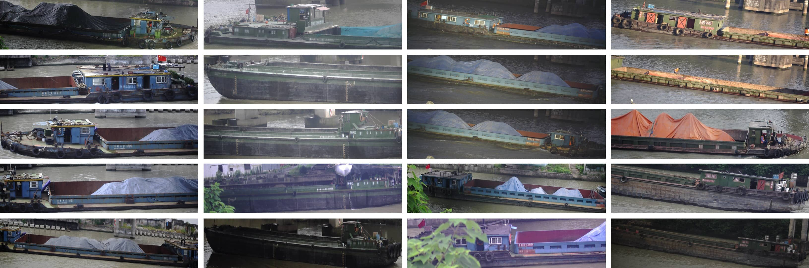
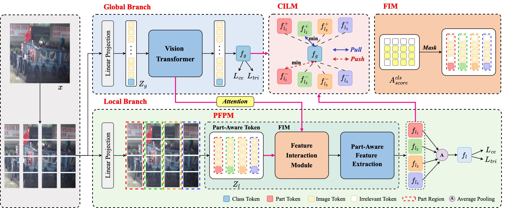

# Advancing Ship Re-Identification in the Wild: The ShipReID-2400 Benchmark Dataset and D2InterNet Baseline Method

## Abstract

Ship Re-Identification (ReID) aims to accurately identify ships with the same identity across different times and camera views, playing a crucial role in intelligent waterway transportation. Compared to the widely researched pedestrian and vehicle ReID, Ship ReID has received much less attention, primarily due to the scarcity of largescale, high-quality ship ReID datasets available for public access. Also, capturing an entire ship can be challenging due to their large size. The visible area of ships is also dynamic, often changing significantly because of variations in cargo loading or water waves. The unique challenges faced by ships make it difficult to achieve ideal results by directly applying existing ReID methods. To address these challenges, in this paper, we introduce **ShipReID-2400**, a dataset for ship ReID compiled from a real-world intelligent waterway traffic monitoring system. It comprises 17,241 images of 2,400 distinct ship identities collected over 53 months, ensuring diversity and representativeness. Then, we propose a feature Disentangle-to-Interact Network (**D2InterNet**) for ship ReID, designed to extract discriminative local features despite significant scale variations. Given that distinctive local details are often tiny compared to the larger, less distinctive areas of ships, D2InterNet first employs a dual-branch architecture to separately focus on global and local features. Moreover, we introduce a Part-aware Feature Perception Module (PFPM) to enhance the extraction of local features, along with a Feature Interaction Module (FIM) and a Collaborative Interaction Learning Module (CILM) to effectively interact and integrate global and local features across different scales. Extensive experimental results show that D2InterNet achieves state-of-the-art ship ReID performance on both the ShipReID-2400 and VesselReID datasets. In addition, despite being designed for ship ReID, D2InterNet demonstrates comparable performance with the best methods on the MSMT17 pedestrian ReID dataset, showcasing its good generalization capability.



**Examples of ships from our ShipReID-2400 (images in each column are captures of the same ship identity from different cameras). As can be seen, we not only ensure that the captured images are of high quality but also obtain images of the same ship at different locations, angles, times, and weather conditions. For ease of presentation, the images here are scaled.**

## Pipeline



**The overall architecture of our proposed D2InterNet. To address significant scale variation and extract discriminative local features for ship ReID, D2InterNet first uses a dual-branch architecture to independently focus on global and local features, enhanced by a Part-aware Feature Perception Module (PFPM) for better local feature capture. We then introduce Feature Interaction Modules (FIM) and Collaborative Interaction Learning Module (CILM) to interact and integrate features across scales. D2InterNet enables flexible dual-branch training and single-branch testing without additional computational overhead.**

## Installation

Our code operates in an environment with Python 3.8 and Torch 1.9.1, you can use the following code for installation. Please ensure to select the appropriate CUDA version.

```shell
conda create -n shipreid python=3.8
conda activate shipreid
pip install torch==1.9.1+cu111 torchvision==0.10.1+cu111 -f https://download.pytorch.org/whl/torch_stable.html
pip install -r requirements.txt
```

## Dataset

You can download the ShipReID-2400 dataset from **[Google Drive](https://drive.google.com/file/d/1OTGK09zo5RKuoGSL-s58e7UzJzIWy7nP/view?usp=sharing)**. The directory structure of the dataset is as follows.

```text
├── ShipReID-2400
  ├── bounding_box_test
  	├── 0002_c001_01_O_20221023_08_15_03_609375.jpg
  	├── 0002_c001_02_T_20221023_08_15_02_296875.jpg
  	├── ...
  ├── bounding_box_train
  	├── 0000_c002_01_T_20220105_11_04_07_484171.jpg
  	├── 0000_c005_01_T_20220211_12_14_53_760375.jpg
  	├── ...
  ├── test_query
  	├── 0002_c001_01_O_20221023_08_15_03_609375.jpg
  	├── 0002_c003_01_O_20210624_23_07_45_611000.jpg
  	├── ...
  ├── val_query
  	├── 0020_c001_01_O_20220321_23_55_36_902558.jpg
  	├── 0020_c003_03_T_20210531_18_59_21_660058.jpg
  	├── ...
```

## Code Structure

Our code structure is as follows.

```shell
ShipReID-2400
├── config     # Initial configuration file definitions
├── configs    # Configuration file directory, storing YML configuration files
├── datasets   # Dataset loading and processing module
├── exp        # Experiment-related files
├── fig        # Figures
├── loss       # Loss function definitions
├── model      # Model definitions and implementations
├── processor  # Training and testing code processors
├── solver     # Optimizers and learning rate schedulers
├── utils      # Utility functions and tools
├── test.py    # Test code
└── train.py   # Train code
```

## Training

You can use the following code for training. Please note that **PART_H** and **PART_W** represent the height and width of the local region, and **PART_RATIO** denotes the percentage retained by the FIM module. Ensure that **DATASETS.ROOT_DIR** is replaced with the path to your dataset.

```shell
# bash exp/train.sh

CUDA_VISIBLE_DEVICES=2 python ../train.py --config_file ../configs/ship/vit_base.yml \
SOLVER.EVAL_PERIOD 20 SOLVER.IMS_PER_BATCH 48 SOLVER.MAX_EPOCHS 200 \
OUTPUT_DIR ./logs/ DATASETS.NAMES "('ShipReID2400')" \
MODEL.PART_H 16 MODEL.PART_W 4 MODEL.ID_LOSS_WEIGHT 0.5 MODEL.TRIPLET_LOSS_WEIGHT 5.0 \
MODEL.PART_ID_LOSS_WEIGHT 0.5 MODEL.PART_TRIPLET_LOSS_WEIGHT 5.0 MODEL.TOKEN_CONTRAST_LOSS_WEIGHT 10.0 \
MODEL.PART_RATIO 0.6 MODEL.TOKEN_CONTRAST_TYPE 'triplet' SOLVER.TOKEN_MARGIN 0.3
```

## Evaluation

You can use the following code for evaluation. Please note that **PART_H** and **PART_W** should correspond to those used during training, and **TEST.WEIGHT** is the path where the weights are stored.

```shell
# bash exp/test.sh

CUDA_VISIBLE_DEVICES=2 python ../test.py --config_file ../configs/ship/vit_base.yml \
OUTPUT_DIR ./logs/ DATASETS.NAMES "('ShipReID2400')" \
MODEL.PART_H 16 MODEL.PART_W 4 \
TEST.WEIGHT 'path_to_test_weight'
```
